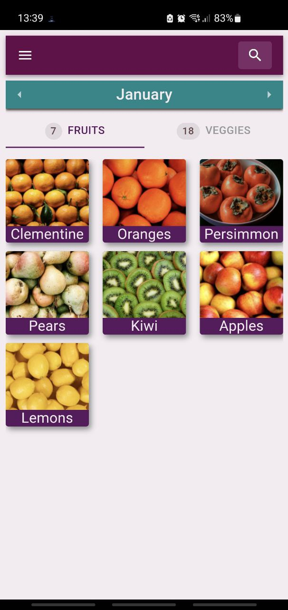

## About the app
This project was developed to address a genuine challenge: determining the availability of fruits and vegetables in a new country or region. Despite searching for solutions and information, I           couldn't find anything intuitive or capable of meeting my needs.
       
The concept behind this project was to create a simple and scalable solution, making it easy to modify and expand the database for different countries or regions. The primary objective of this app is to promote the consumption of locally grown produce, empower small-scale farmers, and ultimately reduce our contribution to global warming.

## First Release (August 2023)

This first release has only data for one co, for now, the data is **only for Italy**. 

Also in this initial release we have a web version and an Android app, also available in English and Italian. 

## Work in progress

We are already planning to add other countries or regions' databases, such as Portugal and France. 
We are also working on improving the search range to include synonyms. For instance, 'plums' are also called 'prunes'.

The release for iOS is something we are also planning on doing until the end of the year.

### Data sources
Source of data for fruits and vegetables from [Slow Food Italy](https://www.slowfood.it/guide-al-consumo/) [Compsumption Guide](https://www.slowfood.it/wp-content/uploads/blu_facebook_uploads/2014/09/ita_guida_consumo_b.pdf)

<!-- Source for mushrooms from [Greenme](https://www.greenme.it/salute-e-alimentazione/mangiare-sostenibile/funghi-stagionalita/) -->

The project is written in React/Typescript using [MUI](https://mui.com/) library for the UI. The Android app is built using [Capacitor](https://capacitorjs.com/).

# How to use

There is a online web version[here](https://fuzue.tech/seasonalfood/). The homepage already shows you the current month and fruits and vegetables of the season in Italy. You can also download a mobile app  in F-Droid or Google Play, and soon it will also be available in Apple store.

## Contribute

### How to build

1. npm i
2. npm run build

### Build Android app

First you do need to have Android SDK and Android Studio installed. After that you can open the project in Android Studio with:

1. npm run build-app
2. ANDROID_SDK=the-path-top-android-sdk CAPACITOR_ANDROID_STUDIO_PATH=the-path-to-android-studio/bin/studio.sh npm run run-app-android